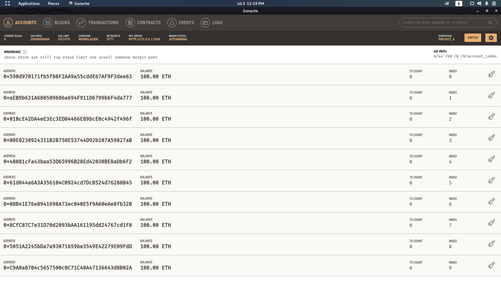
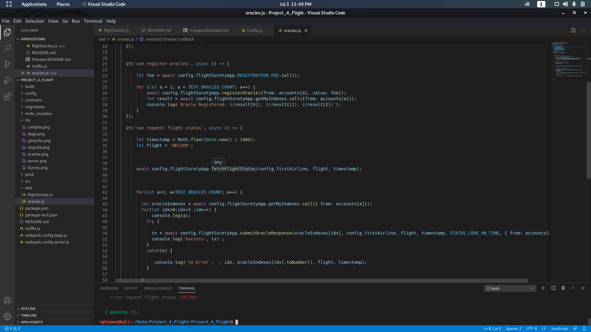

# FlightSurety

Flight Surety is a sample application project for Udacity's Blockchain Nanodegree Programme.
By: Vinay N Sudrik

## Install

This repository contains Smart Contract code in Solidity (using Truffle), tests (also using Truffle), dApp scaffolding (using HTML, CSS and JS) and server app scaffolding.

To install, download or clone the repo, then:

`npm install`

`truffle compile`

 

## Ganache

 

## Develop Client

To run truffle tests:

`truffle test ./test/oracles.js`

 

`truffle test ./test/flightSurety.js`

 

 

To use the dapp:

`truffle migrate --reset` 

 

 

`npm run dapp`

 

To view dapp:

`http://localhost:8000`

## Develop Server

`npm run server`

 

